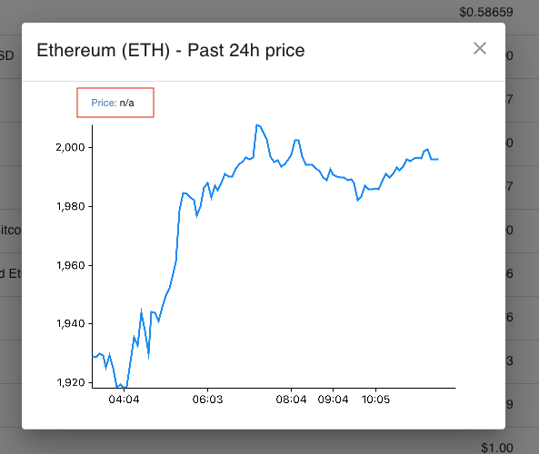

# WELCOME TO CHAOS THEORY

_We are excited to have you here for the onsite development as a pair programming section_

We will be finishing some tasks together based on your code base.

1. UI Tweaks
2. Some functionalities

### Part A

1. Lets rename the title for the page `React App` (e.g. Crypto Market) 😊
2. Add sort by price and name
3. On the currency chart, initialize the price when the chart loaded
   

### Part B

We would like you to add page for the website

The Page Requirements are as followings:

1. Contain the chart of a selected currency
2. Can be navigated to via a button on the site

### Part C

Upon the addition of the page from Part B. We will add simple button and with function call.
In this task, you might need to increase the fetching intervel

**UI**

A button to trigger an action

1. Call a function (Mock API or any action type of your choice)
2. Enabled when the price changes percent is not negative
3. Disabled when the price changes percent is negative
4. Button text can be `CALL`

**Function**

A function for the button to trigger, it can be any fuction type you want to use.

1. To be called by the button stated above
2. Return Success when the change is below a certain value
3. Return Error if the change is above certain value
4. Add delay for the response (optional)

**User Flow**

1. Click the `CALL` button when its enabled
2. Wait for the response (success or not)
3. **Being noticed about the call response**
