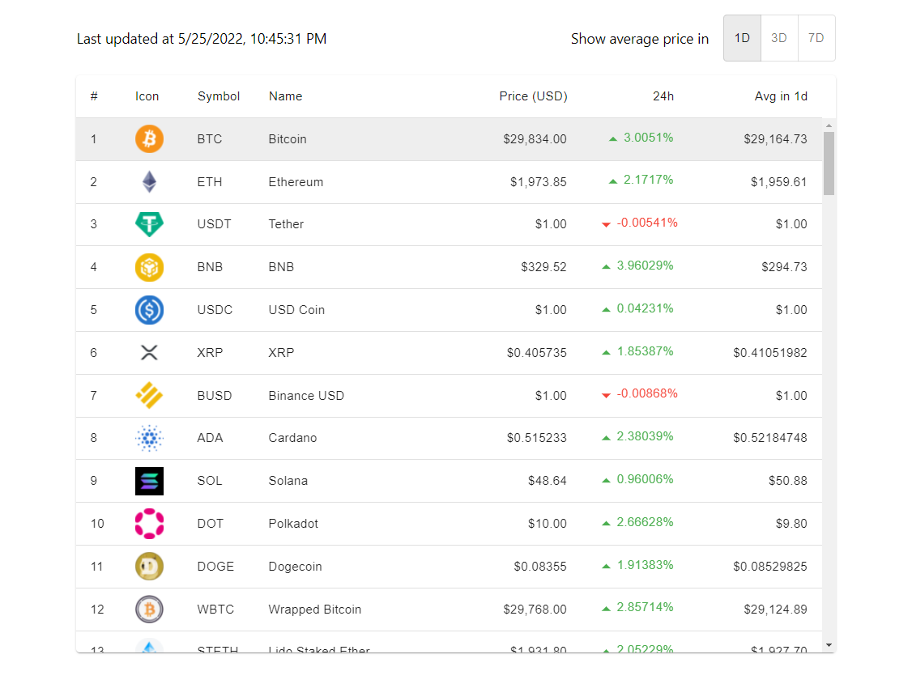
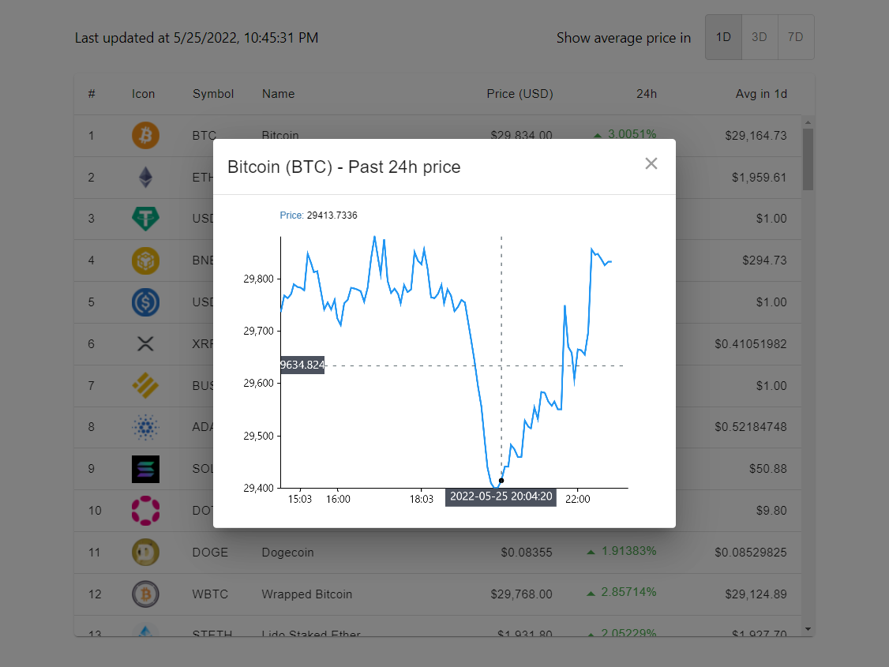

# Crypto dashboard



* :sparkles: Demo site https://cltrainer.github.io/crypto-dashboard/
* This project was bootstrapped with Create React App **(React v16 + Typescript + Material UI)**
* Used **React Financial Charts + React Virtualized + use-color-change**  for visualization
* Used **Jest + Enzyme** for testing


## Get started

Go to project root directory and execute

```bash
$ npm install
$ npm run start
```

The site is ready on [http://localhost:3000](http://localhost:3000)


## Features

### Crypto-currencies price list

* Picked [CoinGecko API](https://www.coingecko.com/en/api)  for the listing 
  * No API key required
  * Fast response time for 100 crypto-currencies comprehensive marketing data
  * High rate limit (up to 50 calls/min) which has enough capacity for demo
  * Free API data refresh for every 5 minutes
* Used *setInterval()* to fetch latest crypto-currencies price per minute
* Used [React virtualized](https://github.com/bvaughn/react-virtualized) to render 100 crypto-currencies listing without lagging
* Used [use-color-change](https://github.com/JonnyBurger/use-color-change) to highlight price with color whenever the exchange rate has increased / decreased


### Crypto-currencies average price list

* CoinGecko API comes with sparkline 7 days data for every crypto-currency
  * I assumed the sparkline data is evenly distributed on 7 days
  * eg. If the sparkline has 163 set of data, I assume each day has 163 / 7 = ~23  set of data
  * By calculating the required the number of data set, the average price can be estimated
  * For simplicity, I picked *1d / 3d / 7d from today* as time frame


### History of a given currency



* For simplicity, I picked last 24-hour exchange rate as historical data
* As the exchange rate data set can be huge, there are not many free and time-series supported chart library available (while some are too old without typescript supported)
* Used [React Financial Charts](https://github.com/react-financial/react-financial-charts) for data visualization with zoom and drag control


## Test

Go to root project directory and execute

```
$ npm run test
```

Or execute this for coverage check

```bash
$ npm run test -- --coverage --watchAll
```

 
